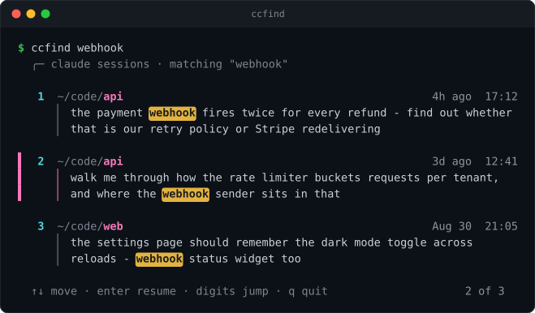
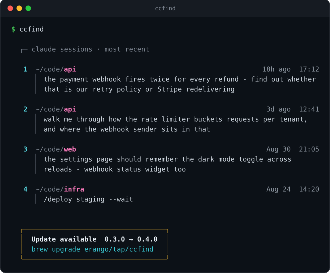

<div align="center">

# ccfind

**Find and resume a Claude Code session, no matter which directory you ran it in.**

[](https://github.com/erango/ccfind/releases)
[](https://github.com/erango/homebrew-tap)
[](LICENSE)



</div>

## The problem

Claude Code files every session under `~/.claude/projects/<slugified-cwd>/`, and `claude --resume`
only ever offers the sessions belonging to the **current** directory. So finding *that conversation
about the webhook retries* means first remembering which of your twenty repos you were sitting in.

`ccfind` searches the prompts **you typed** across every project directory at once, and resumes the
one you pick by `cd`-ing back to where it ran.

## Install

```sh
brew install erango/tap/ccfind
```

Or drop [`bin/ccfind`](bin/ccfind) anywhere on your `PATH` — it's a single script.

## Usage

| Command | What it does |
| --- | --- |
| `ccfind <words...>` | Open the picker with the search box pre-filled |
| `ccfind` | Open the picker on your most recent sessions |
| `ccfind -n 40 <words>` | Cap the number of results (default 20) |
| `ccfind -l <words>` | Print a plain list, no picker |
| `ccfind --reindex` | Rebuild the prompt index from scratch |
| `ccfind --version` | Print the version |

Results open in a picker sized to your terminal, so a long list scrolls instead of running off
the top of the screen. **Just type to search** — every keystroke re-filters against your whole
prompt history, not only what's on screen. A word given on the command line simply seeds that
search box, so `ccfind webhook` and typing `webhook` in the picker land in the same place.

| Key | |
| --- | --- |
| any character | Search, live |
| <kbd>↑</kbd> <kbd>↓</kbd> · <kbd>^p</kbd> <kbd>^n</kbd> | Move |
| <kbd>PgUp</kbd> <kbd>PgDn</kbd> | Page |
| <kbd>Home</kbd> <kbd>End</kbd> | First / last |
| <kbd>Backspace</kbd> · <kbd>^w</kbd> <kbd>^u</kbd> | Delete a character / word / all |
| <kbd>Enter</kbd> | Resume the highlighted session |
| <kbd>Esc</kbd> | Clear the search, then quit |
| <kbd>^c</kbd> | Quit |

Because every letter types into the search box, there are no letter commands — navigation is
arrows and control keys only. Choosing a session runs `claude --resume <session-id>` in its
original directory.

The picker draws on the alternate screen, so quitting leaves your scrollback exactly as it was.
Use `-l` when you want the list to stay on screen or to pipe it somewhere.

Searching matches the whole index row, so a folder name works as a query too — `ccfind fred-agent`
finds every session that ran there.

## Two views

With no query you get the most recent sessions across every directory. Browsing shows each
session's **opening** prompt, which names the topic — unlike whatever `yes` happened to end it.
Searching instead shows the prompt that **matched**, with the match highlighted.

Below, `-l` prints the plain list — the same rendering without the picker.

<div align="center">

</div>

Slash-command prompts are stored as XML; they render the way you typed them
(`/deploy staging --wait`, not `<command-name>/deploy</command-name>…`).

## How it stays fast

Parsing hundreds of megabytes of JSONL on every search would be unusable, so `ccfind` keeps an
index of just your typed prompts — a few hundred KB — under `~/.claude/ccfind-cache/`:

- **`index.tsv`** — one row per prompt: log file, timestamp, cwd, session id, text.
- **`manifest.tsv`** — path and mtime of every session log.

Each run diffs the manifest and re-parses **only** the logs whose mtime changed, carrying the rest
of the index over untouched. In practice that's the one session you have open right now.

| | |
| --- | --- |
| First run, full build | **~5s** |
| Every run after | **~0.2s** |
| Each keystroke in the picker | **in memory** |

The picker holds that whole index in memory, which is what lets a keystroke re-filter your entire
history rather than only the rows on screen — no re-reading, no shelling out, no minimum query
length.

The update check keeps that hot path clean: it hits the GitHub releases API at most once a day,
fully detached, and reports from cache — so it never adds latency, and never blocks you offline.

## Environment

| Variable | Effect |
| --- | --- |
| `CLAUDE_CONFIG_DIR` | Where Claude Code keeps its data (default `~/.claude`) |
| `CCFIND_NO_UPDATE_CHECK` | Set to anything to disable the update check |
| `CCFIND_NO_TUI` | Set to anything to print a plain list instead of the picker |
| `NO_COLOR` | Set to anything to disable color |

## Requirements

- **bash 3.2+** — stock macOS bash is fine
- **`jq`**
- **perl 5** with `POSIX`, `Time::Local` and `Encode`, all core — system perl on macOS and Linux works

Tested on macOS and Linux.

## License

[MIT](LICENSE)
